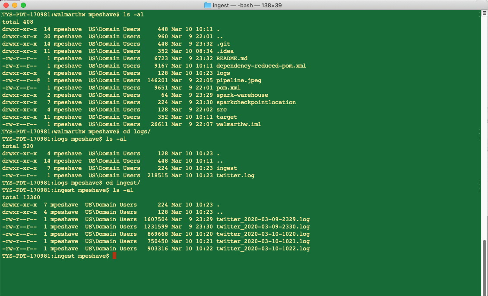
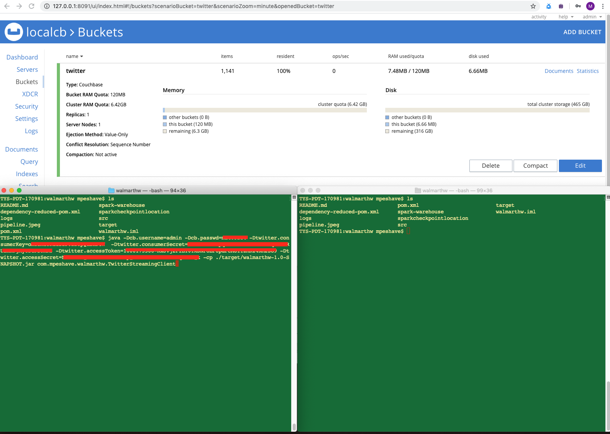
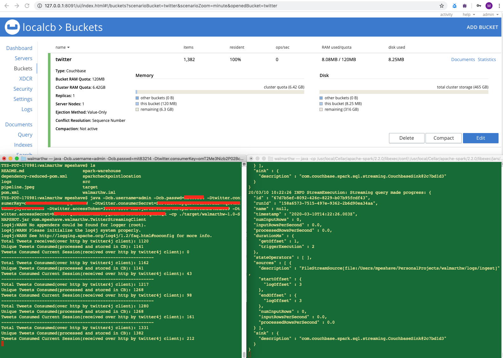

# walmarthw 

Data Pipeline


The project ingests live tweets using the Twitter Streaming API into a CouchbaseDb. The project is 
setup using the following tech:
1) Java 8
2) Spark 2.2.0
3) Scala 2.11
4) Couchbase 6.x
5) Twitter4j - open source repo providing a wrapper over Twitter Streaming API.

The data pipeline as seen in the image has 4 components:
1) Java application - uses the Twitter4j Streaming API to pull live tweets. The application writes it to a 
time based rolling file appender. The application creates a files for each min and puts its in a location 
specified with -Dlog.logBase JVM parameter. If -Dlog.logBase is not specified, the logs will be written to 
./logs/ director. The application also acts as a monitor, keeping count of number tweets received over http, 
number of unique tweets stored in CB and number of tweets received in a session.

2) 1 minute log files that are generated by the java application and are consumed by a spark streaming application.

3) Spark Streaming Application - Spark Structured Streaming application that consumes the 1 min log files
filters outs tweets related to music using basic filter function, repartitions the stream based on tweet id
so ensure duplicates are handled by same executor, theoratically. The transformed tweets are pushed into
couchbase. These mutations in couchbase as upserts to ensure duplicates are not added.

4) Couchbase store - holds tweet documents. The tweet id is used as the document id.

The data pipeline is split up into 2 working process.
1) Java Ingest app, to pull tweets and write to log files.
2) Spark Structured Streaming app to read these log files and push to couchbase.
Splitting up the data pipeline into such component will make it ease to monitor and maintain each component
separately without disturbing the other.

Link to video, going over setup, execution and testing: https://www.youtube.com/watch?v=Axu7DFL3zYU&feature=youtu.be

Steps to setup and run the data pipeline:

Twitter Keys
Consumer Key: omT2Me3Nizb2P02BcpQabhFUW
Consumer Secret: S3P4zAM4WBpqdfuwraHcf9Ea27Wqo04PRULhx9jkyOrGFS3AK5
Access token: 1666173588-iEEYxQBeAfyYdgVL8OKUU8BxCOo0XDnjBHZI5TU
Access token secret: sIfsKPtfEEmgTCMeODScGgF1J0K8ZsYelZc4r8SV6zeDe


1) Java 8 - Check if java 8 is installed.
```
    TYS-PDT-170981:~ mpeshave$ java -version
    java version "1.8.0_181"
    Java(TM) SE Runtime Environment (build 1.8.0_181-b13)
    Java HotSpot(TM) 64-Bit Server VM (build 25.181-b13, mixed mode)
```

If java is not installed, install java 8 and setup the JAVA_HOME correctly.

2) cd to home dir or dir to download and setup code and other components. I assume, this will be setup in home dir.
Create a folder in home dir to download code and other components:
```
    TYS-PDT-170981:~ mpeshave$ pwd
    /Users/mpeshave
    TYS-PDT-170981:~ mpeshave$ mkdir mpeshave_walmarthw
    TYS-PDT-170981:~ mpeshave$
```

3) cd into mpeshave_walmarthw
```
    TYS-PDT-170981:~ mpeshave$ cd mpeshave_walmarthw/
    TYS-PDT-170981:mpeshave_walmarthw mpeshave$ pwd
    /Users/mpeshave/mpeshave_walmarthw
    TYS-PDT-170981:mpeshave_walmarthw mpeshave$ ls
    TYS-PDT-170981:mpeshave_walmarthw mpeshave$
```

4) Download code from git repo:
```
    TYS-PDT-170981:mpeshave_walmarthw mpeshave$ pwd
    /Users/mpeshave/mpeshave_walmarthw
    TYS-PDT-170981:mpeshave_walmarthw mpeshave$ ls
    TYS-PDT-170981:mpeshave_walmarthw mpeshave$ git clone https://github.com/mpeshave/walmarthw.git
    Cloning into 'walmarthw'...
    remote: Enumerating objects: 66, done.
    remote: Counting objects: 100% (66/66), done.
    remote: Compressing objects: 100% (42/42), done.
    remote: Total 66 (delta 12), reused 56 (delta 8), pack-reused 0
    Unpacking objects: 100% (66/66), done.
    TYS-PDT-170981:mpeshave_walmarthw mpeshave$ ls
    walmarthw
    TYS-PDT-170981:mpeshave_walmarthw mpeshave$ ls
    walmarthw
    TYS-PDT-170981:mpeshave_walmarthw mpeshave$ cd walmarthw/
    TYS-PDT-170981:walmarthw mpeshave$ ls
    1.png		2.png		3.png		README.md	pipeline.jpeg	pom.xml		src
    TYS-PDT-170981:walmarthw mpeshave$ 
```

5) Go back to parent dir
```
    TYS-PDT-170981:walmarthw mpeshave$ cd ..
    TYS-PDT-170981:mpeshave_walmarthw mpeshave$ ls
    walmarthw
    TYS-PDT-170981:mpeshave_walmarthw mpeshave$ pwd
    /Users/mpeshave/mpeshave_walmarthw
    TYS-PDT-170981:mpeshave_walmarthw mpeshave$
```

6) Download spark 2.2.0 in the mpeshave_walmarthw dir:
```
    TYS-PDT-170981:mpeshave_walmarthw mpeshave$ pwd
    /Users/mpeshave/mpeshave_walmarthw
    TYS-PDT-170981:mpeshave_walmarthw mpeshave$ curl -o spark-2.2.0-bin-hadoop2.7.tgz https://archive.apache.org/dist/spark/spark-2.2.0/spark-2.2.0-bin-hadoop2.7.tgz
      % Total    % Received % Xferd  Average Speed   Time    Time     Time  Current
                                     Dload  Upload   Total   Spent    Left  Speed
    100  194M  100  194M    0     0  9580k      0  0:00:20  0:00:20 --:--:-- 10.9M
    TYS-PDT-170981:mpeshave_walmarthw mpeshave$ ls
    spark-2.2.0-bin-hadoop2.7.tgz	walmarthw
    TYS-PDT-170981:mpeshave_walmarthw mpeshave$
```

7) Untar the spark 2.2.0 tar file
```
    TYS-PDT-170981:mpeshave_walmarthw mpeshave$ pwd
    /Users/mpeshave/mpeshave_walmarthw
    TYS-PDT-170981:mpeshave_walmarthw mpeshave$ ls 
    spark-2.2.0-bin-hadoop2.7.tgz	walmarthw
    TYS-PDT-170981:mpeshave_walmarthw mpeshave$ tar -xvf spark-2.2.0-bin-hadoop2.7.tgz
    x spark-2.2.0-bin-hadoop2.7/
    x spark-2.2.0-bin-hadoop2.7/NOTICE
    x spark-2.2.0-bin-hadoop2.7/jars/
    x spark-2.2.0-bin-hadoop2.7/jars/parquet-common-1.8.2.jar
    x spark-2.2.0-bin-hadoop2.7/jars/bonecp-0.8.0.RELEASE.jar
    x spark-2.2.0-bin-hadoop2.7/jars/commons-net-2.2.jar
    x spark-2.2.0-bin-hadoop2.7/jars/javax.servlet-api-3.1.0.jar
    x spark-2.2.0-bin-hadoop2.7/jars/hadoop-annotations-2.7.3.jar
    x spark-2.2.0-bin-hadoop2.7/jars/hadoop-hdfs-2.7.3.jar
    x spark-2.2.0-bin-hadoop2.7/jars/oro-2.0.8.jar
    x spark-2.2.0-bin-hadoop2.7/jars/xercesImpl-2.9.1.jar
    x spark-2.2.0-bin-hadoop2.7/jars/antlr-runtime-3.4.jar
    .
    .
    .
    .
    x spark-2.2.0-bin-hadoop2.7/yarn/
    x spark-2.2.0-bin-hadoop2.7/yarn/spark-2.2.0-yarn-shuffle.jar
    x spark-2.2.0-bin-hadoop2.7/README.md
    TYS-PDT-170981:mpeshave_walmarthw mpeshave$ ls
    spark-2.2.0-bin-hadoop2.7	spark-2.2.0-bin-hadoop2.7.tgz	walmarthw
```

8) Setp SPARK_HOME env:
```
    TYS-PDT-170981:mpeshave_walmarthw mpeshave$ pwd
    /Users/mpeshave/mpeshave_walmarthw
    TYS-PDT-170981:mpeshave_walmarthw mpeshave$ ls
    spark-2.2.0-bin-hadoop2.7	spark-2.2.0-bin-hadoop2.7.tgz	walmarthw
    TYS-PDT-170981:mpeshave_walmarthw mpeshave$ export SPARK_HOME=~/mpeshave_walmarthw/spark-2.2.0-bin-hadoop2.7
```

9) Download and setup couchbase: https://www.couchbase.com/downloads locally. Instrucution to download and install 
CB are in the video. It is easy to download and install couchbase locally. During setup, you will have to setup
admin username and password. This will be needed when running java application and spark application.

10) Once the couchbase is setup and running, create a bucket with name - "twitter" through UI. Create the bucket without
a password.

11) ```cd ~/mpeshave_walmarthw/walmarthw ```

12) ```mkdir -p logs/ingest```

13) Go to ~/mpeshave_walmarthw/walmarthw and build the jar:
```    
    TYS-PDT-170981:walmarthw mpeshave$ pwd
    /Users/mpeshave/mpeshave_walmarthw/walmarthw
    TYS-PDT-170981:walmarthw mpeshave$ ls
    1.png		2.png		3.png		README.md	pipeline.jpeg	pom.xml		src
    TYS-PDT-170981:walmarthw mpeshave$ mvn clean package
```    
   This will successfullt buidl the jar in target folder.

14) Ready to run java streaming client:
```
    java -Dcb.username=$COUCHBASE_USERNAME -Dcb.passwd=$COUCHBASE_PASSWD \ 
    -Dtwitter.consumerKey=omT2Me3Nizb2P02BcpQabhFUW \
    -Dtwitter.consumerSecret=S3P4zAM4WBpqdfuwraHcf9Ea27Wqo04PRULhx9jkyOrGFS3AK5 \
    -Dtwitter.accessToken=1666173588-iEEYxQBeAfyYdgVL8OKUU8BxCOo0XDnjBHZI5TU \
    -Dtwitter.accessSecret=sIfsKPtfEEmgTCMeODScGgF1J0K8ZsYelZc4r8SV6zeDe \
    -cp ./target/walmarthw-1.0-SNAPSHOT.jar com.mpeshave.walmarthw.TwitterStreamingClient
```    
   P.S.: REMEMBER TO REPLACE $COUCHBASE_USERNAME and $COUCHBASE_PASSWD variables with actual username and password for
   local couchbase instance.
    
15) If there is an issue, the application will print on the screen. If there is no issue the following will be seen:
```   
   TYS-PDT-170981:walmarthw mpeshave$ java -Dcb.username=admin -Dcb.passwd=mit83214 -Dtwitter.consumerKey=omT2Me3Nizb2P02BcpQabhFUW  -Dtwitter.consumerSecret=S3P4zAM4WBpqdfuwraHcf9Ea27Wqo04PRULhx9jkyOrGFS3AK5 -Dtwitter.accessToken=1666173588-iEEYxQBeAfyYdgVL8OKUU8BxCOo0XDnjBHZI5TU -Dtwitter.accessSecret=sIfsKPtfEEmgTCMeODScGgF1J0K8ZsYelZc4r8SV6zeDe -cp ./target/walmarthw-1.0-SNAPSHOT.jar com.mpeshave.walmarthw.TwitterStreamingClient
    log4j:WARN No appenders could be found for logger (root).
    log4j:WARN Please initialize the log4j system properly.
    log4j:WARN See http://logging.apache.org/log4j/1.2/faq.html#noconfig for more info.
    Total Tweets received(over http by twitter4j client): 0
    Unique Tweets Consumed(processed and stored in CB): 0
    Tweets Consumed Current Session(received over http by twitter4j client): 0
    ------------------------------------------------------------
    Total Tweets Consumed(over http by twitter4j client): 209
    Unique Tweets Consumed(processed and stored in CB): 1
    Tweets Consumed Current Session(received over http by twitter4j client): 209
```

16) Let the java application run for a couple of mins. The application must be printing out number of tweets consumed.
To check the log file, ```cd logs/```. To check if the minute files are rolled over ```cd logs/ingest```.

17) Open a new terminal window and cd into ~/mpeshave_walmarthw/walmarthw directory.
```
    TYS-PDT-170981:~ mpeshave$ pwd
    /Users/mpeshave
    TYS-PDT-170981:~ mpeshave$ cd mpeshave_walmarthw/
    TYS-PDT-170981:mpeshave_walmarthw mpeshave$ ls
    spark-2.2.0-bin-hadoop2.7	spark-2.2.0-bin-hadoop2.7.tgz	walmarthw
    TYS-PDT-170981:mpeshave_walmarthw mpeshave$ cd walmarthw/
    TYS-PDT-170981:walmarthw mpeshave$ ls
    1.png		2.png		3.png		README.md	pipeline.jpeg	pom.xml		src
    TYS-PDT-170981:walmarthw mpeshave$ pwd
    /Users/mpeshave/mpeshave_walmarthw/walmarthw
    TYS-PDT-170981:walmarthw mpeshave$
```
18) Setup SPARk_HOME again:
    ```TYS-PDT-170981:walmarthw mpeshave$ export SPARK_HOME=~/mpeshave_walmarthw/spark-2.2.0-bin-hadoop2.7```
    
19) Run spark application:
```     
    ~/mpeshave_walmarthw/spark-2.2.0-bin-hadoop2.7/bin/spark-submit --master local[2] --driver-memory 4g \
     --conf 'spark.driver.extraJavaOptions=-Dcb.username=$COUCHBASE_USERNAME -Dcb.passwd=$COUCHBASE_PASSWD' \
     --class com.mpeshave.walmarthw.TwitterStreamingIngest ./target/walmarthw-1.0-SNAPSHOT.jar
```    
   P.S.: REMEMBER TO REPLACE $COUCHBASE_USERNAME and $COUCHBASE_PASSWD variables with actual username and password for
        local couchbase instance.
    
   Give a few seconds and check the java applications terminal. The unique count of tweets in CB should have increased.
   Also check the couchbase UI and check item count.
    
    
Output Screenshots:

1) Shows the project directory setup and where the 1 minute log files will be written by the java application after
it is trigger:


2) Shows state before the pipeline is started. Top: Couchbase web UI; shows there are 1141 doc added previously. 
Bottom Left: API Java App, Bottom Right: Spark Streaming App.


3) Shows the state after java and spark applications are running for a couple of mins. 
Top: Couchbase UI, number of documents pushed have increased.
Bottom Left: Java Application showing running counts.
Bottom Right: Spark Streaming Application running and consuming files.


Questions:

1) What are the risks involved in building such a pipeline?

Firstly, as such a pipeline is based on an external dependecy, the external resource may change without
notification which may cause failures of the ingestion pipeline or receive inconsitent/corrupt data.
Secondly, setting up the pipeline as single process program wouldnt be efficient. So, it will need to be 
split up into multiple component. Having multiple components running in union proves another challenge,
as all the components must be monitored and maintained. Testing such a pipeline end to end is also cumbersome
and requires validations and checks at multiple places.  

2) How would you roll out the pipeline going from proof-of-concept to a production-ready solution?

As the pipeline is split up into multiple components, each components can worked on independently to be pushed
to prod. To start with, the first ingestion component(ingest - consuming the data from twitter) must be worked on.
The component will need some sort of application monitoring and alerts setup. Also, currently the 1 min log files
are written to local disk. To productionalise these will need to be moved to some distributed storage. This 
may require changes to either the application or a separate process move the files to distributed storage. This would
be a good point to push to pre-prod and do some testing and push the ingestion component to prod.
A prod couchbase cluster setup would follow next with monitoring and alerting setup around it. Next, would be to
make changes to the spark streaming application to make it consume files created/stored in cloud storage and changes
to be able to connect to the new couchbase cluster. As this will be a long running streaming application next would 
be to setup monitoring around the nodes/cluster this spark application runs on. As each component is added one at a 
time, integration testing will be needed as well as data validation. To start with these processes can be manual 
but eventually these can be automated. If this is to be moved to cloud, setting up process 
networking/permissions/roles and required infrastructure will also need to be considered. 
Second iteration could be a full streaming pipeline where the java applcaition is consuming tweets over 
http and pushing them into a kafka stream.

3) What would a production-ready solution entail that a POC wouldn't?
    1) Most important would be a backfill/replay mechanism in case of failure. 
    2) Requirements on what transformation/cleanup on the data are needed before storing it. 
    3) Standard file storage format(avro parquet) for log files, that can handle changing schema and compression.
    4) Scalable ingestion pipeline based on load.
    5) Better document compression and storage in couchbase. Changed document schema that represents information in a
    better way.
    6) Checks and validations at various stages of the pipeline.

4) What is the level of effort required to deliver each phase of the solution?
Assuming level of effort in sprints, each phase will take up to sprint and half to two sprints with 2 
engineers working.

5) What is your estimated timeline for delivery for a production-ready solution?
First iteration of a production ready solution for this may take up to 4 or 5 sprints.


 
 
